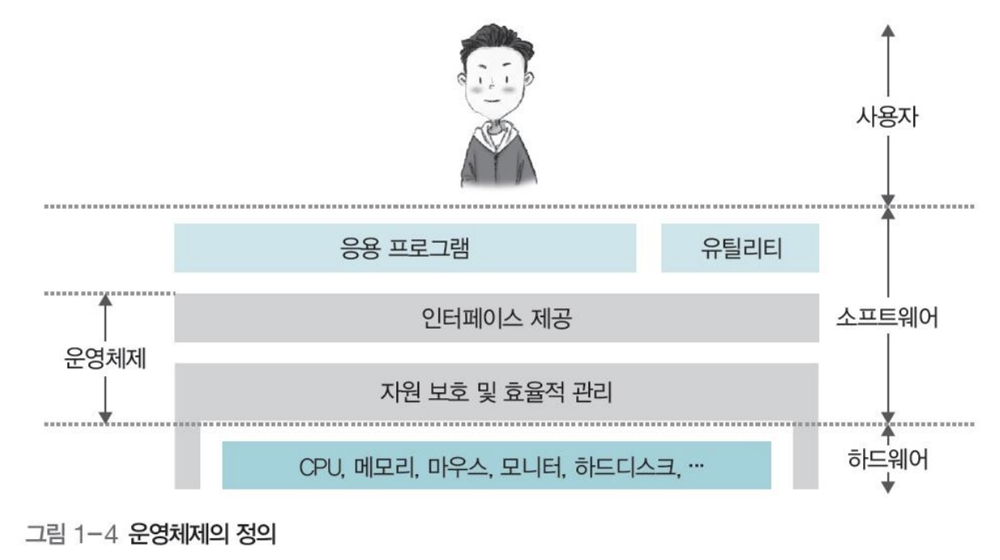
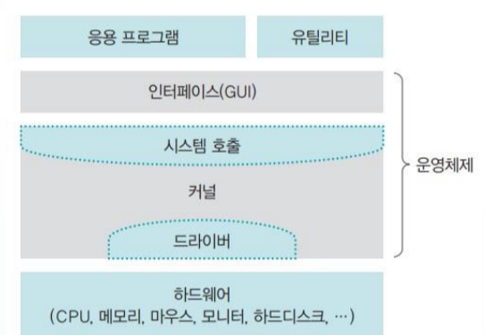

## **Chapter 01. 운영체제의 개요**

---

### 목차
[01. 운영체제 소개](#01-운영체제-소개)  
[02. 운영체제의 역사](#02-운영체제의-역사)  
[03. 운영체제의 구조](#03-운영체제의-구조)  
[04. [심화학습] 운영체제의 종류와 역사](#04-[심화학습]-운영체제의-종류와-역사)

---

### 01. 운영체제 소개

1. **일상생활 속의 운영체제**

운영체제 - OS - Operating System

- 운영체제(MAC OS, Window..), 모바일 운영체제(iOS, Android..), 임베디드 운영체제(PMP, MP3..)
- 임베디드 운영체제 or 시스템 : CPU 성능 낮고 메모리 크기 작은 시스템에 내장한 운영체제
- **운영체제가 있는 기계는 기능 추가 및  계속 향상 가능**

1. **운영체제의 필요성**

운영체제 없이 작동 가능한 컴퓨터 - 에니악: 전선의 연결을 통한 프로그래밍 효과 (기능적 제약)

운영체제가 있는 기계는 새로운 기능의 추가나 성능의 변경이 가능 ⇒ 성능 및 효율성의 향상

   ⇒ 프로그램이 가능한 기계

성능향상 뿐 아니라, **자원관리 역할**

응용 프로그램을 차지하려는 다양한 하드웨어(키보드, 모니터..) or 응용 프로그램 간 자원 경쟁 - 자원을 관리하는 중재 역할

컴퓨터에 부착된 모든 장치인 '컴퓨터 자원' - 사용자가 직접 자원에 접근하는 것을 막아 자원을 보호하고 관리함 ⇒ 부탁하는 방식 - 운영체제는 응용프로그램과 사용자에게 모든 자원을 숨김

사용자가 컴퓨터를 사용할 수 있도록 해주고 그 결과를 알려주는 '인터페이스'를 제공해 컴퓨터 자원을 보호하며 사용자의 편의를 도모

운영체제 - 소프트웨어와 하드웨어의 결합 형태인 펌웨어(firmware)로도 표현됨

1. **운영체제의 정의**

 운영체제는 **사용자에게 편리한 인터페이스 환경을 제공하고, 컴퓨터 시스템의 자원을 효율적으로 관리하는 소프트웨어** 이다.

  

1. **운영체제의 역할**
    1. **자원 관리**
    여러 응용 프로그램의 사용시, 키보드/사운드카드 등 여러 컴퓨터 자원 사용
      ⇒ 자원을 응용프로그램에게 적절히 나누어주어 사용자가 원활히 작업할 수 있도록 해줌
      ⇒ + 자원 회수, 자원 배분
    2. **자원 보호**
    어떤 응용 프로그램이 남의 영역 침범하는 것 방지
    비정상적 작업으로부터 컴퓨터의 자원을 보호
    3. **하드웨어 인터페이스 제공**
    복잡한 과정 없이 다양한 장치 사용할 수 있도록 하드웨어 인터페이스 제공
      ⇒ 드라이버 설치를 통해 하드웨어 인터페이스 지원이 제공됨 (몇몇은 따로 설치 필요)
    즉, 드라이버 = 하드웨어 인터페이스
    4. **사용자 인터페이스 제공**
    운영체제를 편리하게 사용하도록 지원하는 **사용자 인터페이스**
    최근, GUI(그래픽 사용자 인터페이스)를 제공 - 대부분 마우스로 수행
    스마트폰 - 터치스크린을 통한 여러 동작
2. **운영체제의 목표**
    1. **효율성** ←→ 자원 관리
    운영체제의 목표: 효율적 자원관리
    같은 자원을 사용하여 더 많은 작업량 처리, 같은 작업량 처리에 적은 자원 사용
      ⇒ 운영체제의 크기 최소화, 운영체제가 사용하는 코드의 최적화를 통해
    2. **안정성** ←→ 자원 보호
    운영체제 - 하드웨어 전체를 관리하는 소프트웨어 
    사용자와 응용프로그램은 운영체제 위에서 작업을 한다
      ⇒ 운영체제가 불안정하면 모든 작업이 불안정해짐 
    즉, 안전 문제 + 보안문제를 처리할 수 있어야함
    + 시스템 문제 발생시 이전으로 복구하는 **'결함 포용(fault tolerant)' 기능**을 수행하여야 함
    3. **확장성** ←→ 하드웨어 인터페이스 제공
    다양한 시스템 자원의 추가 제거 편리해야함(확장성)
    플러그 앤 플레이 기능의 제공
    사용자의 편리성 + 하드웨어 제작자의 편리성 고려
    4. **편리성** ←→ 사용자 인터페이스 제공
    사용자가 편리하게 작업할 수 있는 환경의 제공 - ex) GUI 통한 마우스와 키보드의 사용
    응용 프로그램과 사용자에 편리성 제공 + 자원의 낭비 요소를 막아야 함

---

### 02. 운영체제의 역사

1. 초창기 컴퓨터 (1940년대) - 애니악
    1. 키보드, 마우스, 모니터와 같은 주변장치가 없어 진공관으로 2진법(0과 1) 사용
2. 일괄 작업 시스템 (1950년대)  - 한 번에 한 가지 작업만 진행
    1. 중앙처리장치인 CPU와 메인메모리 등장
        1. 메인메모리 → 운영체제 영역과 사용자 영역으로 구분
    2. 입력장치 : 천공카드 리더 / 출력장치 : 라인 프린터
    3. 모든 작업 한꺼번에 처리, 프로그램 실행 중간에 데이터 입력 및 수정 불가능
3. 대화형 시스템 (1960년대 초반)  - 키보드와 모니터 등장
    1. 작업 중간 사용자의 입력 가능 및 진행 상황 확인 가능
    2. 작업 시간 예측 어려움
4. 시분할 시스템 (1960년대 후반) - 다중 프로그래밍(multiprogramming), (multitasking)
    1. CPU 사용 시간을 잘개 쪼개어 하나의 CPU로 여러 작업 동시에 진행
    2. 시분할 시스템이 가능해지면서 다중 사용자 시스템이 가능해졌고 유닉스 등장
5. 분산 시스템 (1970년대 후반) - 개인용 컴퓨터와 인터넷 등장
    1. 네트워크상에 분산되어 있는 여러 컴퓨터로 작업 처리 및 결과 상호 교환
6. 클라이언트/서버 시스템 (1990년대 ~ 현재) - 웹 시스템
    1. 클라이언트가 서버에 작업을 요청하면 서버가 해당 작업을 처리하는 구조
    2. 모든 요청이 서버로 집중될 경우 서버 과부하 발생
7. P2P 시스템 (2000년대 초반 ~ 현재) - 메신저, 파일 공유
    1. 서버를 거치지 않고 사용자와 사용자를 직접 연결하여 서버 과부하 문제 해결
8. 기타 컴퓨팅 환경 (2000년대 초반 ~ 현재) 
    1. 그리드 컴퓨팅 : 필요한 컴퓨팅 자원을 구매하여 사용
    2. 클라우드 컴퓨팅 : 언제 어디서나 응용 프로그램과 데이터 자유롭게 사용 가능
    3. 사물 인터넷 : 사물에 내장된 센서와 통신 기능과 인터넷 연결

---

### 03. 운영체제의 구조

1. 커널과 인터페이스
    1. 운영체제는 크게 커널에 명령을 전달하고 실행 결과를 사용자와 응용 프로그램에 돌려주는 **인터페이스**와 운영체제의 핵심 기능을 모아놓은 **커널**로 이루어짐
        
        **컴퓨터 시스템 구조**

        

          
        

    
---

1. 시스템 호출과 디바이스 드라이버
    1. **시스템 호출**
        1. 커널은 사용자나 응용 프로그램으로부터 컴퓨터 자원을 보호하기 위해 자원에 직접 접근하는 것을 차단하기 때문에 시스템 호출이라는 인터페이스를 이용하여 접근 가능
        2. 시스템 호출을 거치지 않고 커널 진입 불가능
        3. 시스템 호출은 커널이 제공하는 시스템 관련 서비스를 모아놓은 것으로 함수 형태로 제공됨 → print(), write(), read()
    2. **디바이스 드라이버** 
        1. 하드웨어 인터페이스 담당
        2. 커널이 제공하는 드라이버와 하드웨어 제작자가 제공하는 드라이버가 있음
            1. 마우스, 키보드와 같은 디바이스 드라이버는 커널에 포함되어 있어 컴퓨터에 꽂기만 하면 작동되지만 그래픽카드, 프린터와 같이 크기가 크고 복잡한 디바이스 드라이버는 사용자가 직접 설치해야함
2. 커널의 구성 
    1. 커널 역할 : 프로세스 관리, 메모리 관리, 파일 시스템 관리, 입출력 관리, 프로세스 간 통신(IPC)
    2. **단일형 구조 커널** 
        1. 커널의 핵심 기능을 구현하는 모듈 하나로 구성
        2. 모듈 간의 통신 비용이 감소하여 효율적인 운영이 가능하나 운영체제의 여러 기능이 서로 연결되어 있어 기능상의 작은 결함 시스템 전체로 확산 가능
        3. 모든 모듈이 하나로 묶여 있어 수정이 어렵고 이식성이 낮음
    3. **게층형 구조 커널**
        1. 비슷한 기능을 가진 모듈을 묶어서 하나의 계층으로 만들고 계층 간의 통신을 통해 운영체제 구현
        2. 오류 발생 시 해당 계층만 따로 수정가능하여 디버깅이 용이함
    4. **마이크로 구조 커널**
        1. 프로세스 관리, 메모리 관리, 프로세스 간 통신 관리 등 가장 기본적인 기능만 제공하고 나머지 기능은 사용자 영역에 구현
        2. 각 모듈은 독립적으로 작동하기 때문에 하나의 모듈이 실패하더라도 전체 운영체제에 영향을 미치지 않고 이식성이 높음
3. 가상머신
    - 운영체제와 응용 프로그램 사이에서 작동하는 프로그램으로 가상머신 설치 시 동일한 환경에서 응용 프로그램 작동 가능
    - C언어는 유닉스와 다른 커널을 가진 운영체제와의 호환성이 떨어지는 반면, 자바는 자바 가상머신 JVM을 제공하여 코드 수정없이 대부분의 운영체제에서 작동 가능

---

### 04. [심화학습] 운영체제의 종류와 역사

1. 유닉스와 리눅스
    1. 유닉스의 개발과 확산
        
        1960년대, '일관성과 단순함을 지향하는 운영체제' 철학을 가진 유닉스의 등장 
        
        다른 기계로 이식하기 쉬운 C언어의 특성 ⇒ 소스코드 공개 + 인기 + 다양한 기능 추가
        
    2. BSD 유닉스의 개발
        
        1978년 유닉스 소스코드를 조금씩 수정하여 BSD버전 유닉스의 개발
        
        다중 작업 지원 + 네트워킹 소프트웨어의 개발
        
    3. 다양한 유닉스 버전의 개발
        
        울트릭스, 제닉스, 솔라리스 등의 등장
        
        마하 유닉스 - 매우 작은 커널 유닉스 - 이후 매킨토시에 사용됨
        
    4. GNU(GNU is Not Unix)
        
        리처드 스톨먼이 창설한 GNU 프로젝트
        
        '소프트웨어를 돈 주고 사지 말고, 누구나 자유롭게 실행, 복사, 수정, 배포할 수 있게 하자'
        
        ⇒ 이런 정신에 입각해 만든 소프트웨어에 주어진 라이선스 GPL(General Public License)
        
        ⇒ copyright의 반대개념인 copyleft를 내세움
        
    5. 리눅스의 개발
        
        1991년, 리누스 토르발스가 PC에서 동작하는 유닉스 호환 커널의 작성, GPL로 배포, 소스코드 공개 ⇒ 리누스 토르발스의 이름을 딴 리눅스의 탄생
        
        워크스테이션, 대형 컴퓨터, 스마트폰 등 다양한 환경에서 작동하는 운영체제
        
2. 매킨토시와 스티브 잡스
    1. 애플 II의 등장
        
        1976년 스티브잡스의 애플 창업, 1977년 '애플 II' 개인용 컴퓨터 대중화
        
        다양한 주변장치 연결 + 내장 언어로 다양한 프로그램 제작
        
        전자게임 덕분에 급속도로 보급됨 ⇒ 다양한 사무용, 교육용 소프트웨어의 출시
        
    2. 스티브 잡스의 업적
        
        애플 II - 모든 사람이 사용할 수 있도록 컴퓨터의 인식을 변화 시킴
        
        ⇒ 다양한 하드웨어와 소프트웨어의 개발
        
        사용자 친화적이고 경험에 중심을 두는 UX(User Experience)에 중점을 둠
        
        마우스 이용 GUI를 처음 도입한 Mac OS의 제작
        
        좋은 사용자 인터페이스 + 편한 음악 유통구조 아이튠즈 제작 ⇒ MP3 플레이어 시장 장악
        
        최초 멀티터치스크린 적용 아이폰의 제작 
        
3. 윈도우 운영체제
    1. MS-DOS의 개발
        
        1983년, IBM의 개인용 컴퓨터 시장 진입 - IBM XT 컴퓨터 출시
        
        마이크로소프트가 만든 디스크 기반의 OS, MS-DOS를 플로피디스크에 담아 보급
        
        IBM XT 설계 공개 + 생산 및 판매 허용 오픈 정책 ⇒ 다양한 호환 컴퓨터 보급 ⇒ 관련 게임, 소프트웨어 개발, 애플 시장 점유율 하락
        
        하지만, IBM은 큰 이득X ⇒ 관련 CPU 및 운영체제 업체 인텔의 성장
        
    2. 윈도우의 출시
        
        애플 Mac OS의 GUI에 자극 받아 윈도우 운영체제 출시 ⇒ 전 세계 PC 시장의 90% 이상 장악
        
4. 모바일 운영체제
    1. 스마트폰의 등장
        
        애플의 아이폰이 스마트폰 시장 장악 - 아이폰 자체 개발 운영체제 iOS
        
        구글의 모바일용 운영체제 안드로이드 개발
        
    2. 안드로이드의 특징
        
        안드로이드 - 리눅스 커널, 자바 기반 - 호환성이 뛰어남 - 다른 플랫폼으로 포팅 가능
        
        GNU 리눅스 커널 사용해 GPL을 따름 - 공짜 사용, 소스코드 공개 - 스마트폰 제조사들은 안드로이드의 소스코드를 자사 제품에 맞게 수정해 무료 배포
        
    3. 특허 전쟁
        
        안드로이드의 기능 중 일부가 마이크로소프트의 특허를 침해
        
        ⇒ 안드로이드 사용 회사들이 마이크로소프트에 많은 돈 지불 ⇒ 특허를 통한 막대한 수익
        
    4. 무료 배포의 철학
        
        GNU - 무료로 사용 해보고, 좋은 소프트웨어라 판단되면 돈을 지불받음
        
        구글 - 안드로이드의 무료 배포 - 앱 수익, 구글 사이트 연동 등 다양한 수익 창구
        
        애플 - 아이팟, 아이폰을 통한 MP3, 게임, 영화 등 콘텐츠 유통을 통한 이익
        

- 헷갈리는 용어 정리
    - multitasking : 여러 작업을 동시에 수행하는 것 - 일반적인 용어
    - multiprogramming : 여러 프로그램이 메모리에 올라가 있음 - 메모리 측면 강조
    - time sharing : CPU의 시간을 분할하여 사용 - CPU 측면 강조
    - multiprocess : 여러 프로그램 동시에 실행
    
    → 위의 네 가지 용어는 같은 의미
    
    - multiprocesser : 다중 CPU
    

---

Reference

- [https://velog.io/@sunil1369/쉽게-배우는-운영체제-ch15](https://velog.io/@sunil1369/%EC%89%BD%EA%B2%8C-%EB%B0%B0%EC%9A%B0%EB%8A%94-%EC%9A%B4%EC%98%81%EC%B2%B4%EC%A0%9C-ch15)