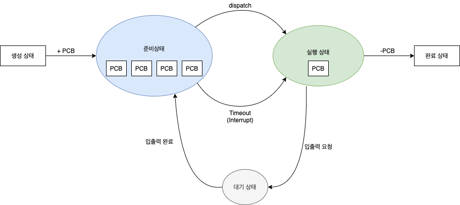
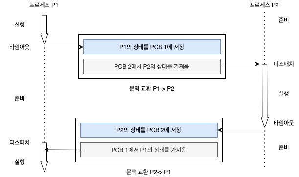

## Chpater 03. 프로세스와 스레드

---

### 목차
[01. 프로세스의 개요](#01-프로세스의-개요)  
[02. 프로세스 제어 블록과 문맥 교환](#02-프로세스-제어-블록과-문맥-교환)  
[03. 프로세스의 연산](#03-프로세스의-연산)  
[04. 스레드](#04-스레드)  
[05. [심화학습] 동적 할당 영역과 시스템 호출](#05-심화학습-동적-할당-영역과-시스템-호출)

---

### 01. 프로세스의 개요
- Chapter 02의 폰 노이만 구조: 모든 프로그램은 메모리에 올라와야 실행 가능하다
- 쉽게 말해, 저장장치에 정적인 상태로 존재하는 것을 '프로그램'이라 하고, 메모리에 올라온 동적인 상태를 '프로세스'라 한다.
- 즉, 프로그램을 실행하면 프로세스가 된다.
<br><br>
1. 프로그램에서 프로세스로의 전환
   - 프로그램이 프로세스로 전환되면 프로세스 제어 블록(PCB)을 받는다.
   - 프로세스 제어 블록에는 프로세스를 처리하는 데 필요한 다양한 정보가 들어있는데 대표적인 세 가지는 다음과 같다.
     - 프로세스 구분자(PID) : 각 프로세스를 구분하는 구분자이다.
     - 메모리 관련 정보 : 메모리에 올라온 프로세스가 메모리의 어디에 저장되어 있는지 알아야 하기 때문에 메모리 위치 정보가 담겨 있고, 메모리 보호를 위해 경계 레지스터와 한계 레지스터도 포함되어 있다.
     - 각종 중간값 : 시분할 시스템에서는 일정 시간동안 CPU를 할당받아 여러 프로세스가 번갈아 실행되기 때문에 프로세스가 사용했던 중간값이 저장된다.

   - 한마디로 요약하면, 저장장치에 있는 프로그램이 메모리에 올라와 실행되면 프로세스로 전환되고 운영체제로부터 프로세스 제어 블록을 받을 수 있으며 프로세스가 종료되면 프로세스 제어 블록도 폐기된다.
<br><br>
2. 프로세스의 상태
   1. 생성 상태 : 프로세스가 메모리에 올라와 실행 준비를 완료한 상태로 프로세스 제어 블록이 생성된다.
   2. 준비 상태 : 생성된 프로세스가 CPU를 얻을 때까지 기다리는 상태이다.
      1. CPU 스케줄러는 준비 큐의 맨 앞에서 기다리고 있는 프로세스 중 하나를 골라 실행 상태로 바꾸는데 이 작업을 디스패치 `dispatch(PID)` 라고 한다.
      2. CPU 스케줄러는 프로세스의 전 상태에 관여하여  모든 프로세스의 작업이 원만하게 진행되도록 관리한다.
   3. 실행 상태 : 준비 상태에 있는 프로세스 중 하나가 CPU를 얻어 실제 작업을 수행하는 상태로, 일정 시간(타임 슬라이스) 동안 CPU를 할당받는다. 만약 할당된 시간 내에 작업을 완료하지 못하면 준비 상태로 돌아와(타임아웃) `timeout(PID)` 다음 차례를 기다린다.
   4. 완료 상태 `exit(PID)` : 실행 상태의 프로세스가 주어진 시간 동안 작업을 마친 상태로 프로세스 제어 블록이 폐기된다.
   5. 대기 상태 `block(PID)` : 입출력을 요구한 프로세스가 입출력이 완료될 때까지 기다리는 상태로 입출력이 완료되면 입출력 관리자로부터 인터럽트를 받고 준비 상태로 돌아가 `wakeup(PID)` 자기 차례를 기다린다.
   6. 휴식 상태 : 프로세스가 작업을 일시적으로 쉬고 있는 상태로 메모리에 존재하며 프로세스 제어 블록도 유지된다.
   7. 보류 상태 : 프로세스가 메모리 밖으로 쫓겨난 상태로 스왑 영역에 보관된다.
      1. 보류 상태는 대기 상태에서 옮겨진 보류 대기 상태와 준비 상태에서 옮겨진 보류 준비 상태로 구분되며, 각 상태에서 재시작하면 원래의 활성 상태로 돌아간다.
      2. 보류 대기 상태에서 입출력이 완료되면 보류 준비 상태로 돌아간다.

<p align="center">
  
</p>
<p align="center">[그림1. 프로세스의 상태]</p>
<br>

------

### 02. 프로세스 제어 블록과 문맥 교환

1. 프로세스 제어 블록(PCB)

   프로세스 제어 블록에는 프로세스를 처리하는 데 필요한 다양한 정보가 들어있다고 배웠다. 그렇다면 어떤 정보가 저장되는지, 각 정보가 어떤 역할을 하는지 알아보자.

   1. 포인터 : 프로세스 제어 블록의 첫 번째 블록에 저장되며 준비 상태나 대기 상태의 큐를 구현할 때 사용한다.
   2. 프로세스 상태 : 프로세스 제어 블록의 두 번째 블록에 저장되며 프로세스가 현재 어떤 상태에 있는지를 나타낸다.
   3. 프로세스 구분자 : 각 프로세스를 구분하기 위한 구분자를 저장한다.
   4. 프로그램 카운터 : 다음에 실행될 명령어의 위치를 가리키는 프로그램 카운터의 값을 저장한다.
   5. 프로세스 우선순위 : 프로세스의 우선순위는 다 다르기 때문에 CPU 스케줄러는 프로세스 우선순위를 기준으로 준비 상태에 있는 프로세스를 실행 상태로 옮긴다.
   6. 각종 레지스터 정보 : 프로세스가 실행되는 중에 사용하던 레지스터 중간값을 보관한다.
   7. 메모리 관리 정보 : 메모리 위치 정보와 메모리 보호를 위한 경계 레지스터 값과 한계 레지스터 값 등이 저장된다.
   8. 할당된 자원 정보 : 프로세스를 실행하기 위해 사용하는 입출력 자원이나 오픈 파일 등에 대한 정보가 저장된다.
   9. 계정 정보 : 계정 번호, CPU 할당 시간, CPU 사용 시간 등이 저장된다.
   10. 부모 프로세스 구분자(PPID)와 자식 프로세스 구분자(CPID)

2. 문맥 교환

문맥 교환은 두 프로세스의 프로세스 제어 블록을 교환하는 작업으로 타임아웃 또는 인터럽트 발생 시 일어난다. 실행 상태에서 나가는 프로세스 제어 블록은 지금까지의 작업 내용을 저장하고, 실행 상태로 들어오는 프로세스 제어 블록으로 CPU가 다시 세팅된다.

다음은 문맥 교환 과정을 나타낸 그림으로 1) 실행 상태에 있는 프로세스 P1이 타임아웃되면 P1의 프로세스 제어 블록에 현재까지의 작업 결과가 저장되고 P1은 준비 상태로 쫓겨난다. 2) 준비 상태에 있던 프로세스 P2가 실행 상태로 가면 CPU의 레지스터가 P2의 프로세스 제어 블록 값으로 채워져 다음 작업을 진행하는 것을 나타낸다.

<p align="center">
  
</p>
<p align="center">[그림2. 문맥 교환]</p>
<br>

---

### 03. 프로세스의 연산

1. 프로세스 구조

   프로세스는 코드 영역, 데이터 영역, 스택 영역으로 구성된다.

   1. 코드 영역 : 프로그래머가 작성한 프로그램은 코드 영역에 탑재되며

      ⇒ 읽기 전용

   2. 데이터 영역 : 코드가 실행되면서 사용하는 변수나 파일 등의 각종 데이터를 모아놓은 곳

      ⇒ 읽기 / 쓰기

   3. 스택 영역 : 운영체제가 프로세스를 실행하기 위해 부수적으로 필요한 데이터를 모아놓은 곳으로 운영체제가 사용자의 프로세스를 작동하기 위해 유지하는 영역

      ⇒ 숨김 영역

2. 프로세스 생성과 복사

   1. fork() 시스템 호출의 개념

      실행 중인 플세스로부터 새로운 프로세스를 복사하는 함수

      기존의 프로세스는 부모 프로세스 / 새로 생긴 프로세스는 자식 프로세스

      ⇒ 두 프로세스는 부모-자식 관계로 연결 됨

      워드프로세서 작업 중 새로운 워드프로세서 실행, 크롬 Ctrl + N

   2. fork() 시스템 호출의 동작 과정

      PCB를 포함한 부모 프로세스 영역의 대부분이 자식 프로세스에 복사되지만, 변경 사항 존재

      - 프로세스 구분자(PID)가 변경된다 - 자식과 부모의 PID는 다르다

      - 메모리 관련 정보가 바뀐다 - 자식과 부모의 프로세스가 차지하는 메모리 위치는 다르다

      - 부모 프로세스 구분자(PPID)와 자식 프로세스 구분자(CPID)가 바뀐다

        ⇒ 자식 프로세스는 자식 프로세스가 없으므로 CPID의 값이 -1 이다

   3. fork() 시스템 호출의 장점

      - 프로세스의 생성 속도가 빠르다

        하드디스크에서 프로그램을 새로 가져오지 않고, 기존 메모리에서 복사하기 때문

      - 추가 작업 없이 자원을 상속할 수 있다

        부모 프로세서가 사용하던 모든 자원을 추가 작업 없이 자식이 상속받을 수 있다

      - 시스템 관리를 효율적으로 할 수 있다

        PPID와 CPID로 연결되어, 자식 프로세스 종료시 해당 자원을 부모 프로세스가 정리할 수 있다

3. 프로세스의 전환

   1. exec() 시스템 호출의 개념

      - 기존의 프로세스를 새로운 프로세스로 전환하는 함수

      - 프로세스는 그대로 둔 채 내용만 바꾸는 시스템 호출

        ⇒ 현재의 프로세스가 완전히 다른 프로세스로 전환됨

      사용목적: 프로세스의 구조체를 활용하기 위함

      ⇒ 새 프로세스 시작시, PCB를 만들고 메모리 확보 과정이 필요하고, 프로세스 종료시 메모리 청소를 위한 상위 프로세스와 부모-자식 관계를 만들어야하는데, exec()를 통해 기존 프로세스의 제어 블록, 메모리 영역, 부모-자식 관계 그대로 재활용이 가능 - 새로운 코드 영역만 가져오면 됨

   2. exec() 시스템 호출의 동작 과정

      기존 코드 영역의 내용을 지우고 새로운 코드로 바꿈 + 데이터 영역이 새로운 변수로 채워짐 + 스택 영역의 리셋

      PCB의 내용 대부분 변화X - 각종 레지스터와 사용한 파일 정보는 리셋

   3. exec() 시스템 호출의 예

**⇒ 즉, fork() - 프로세스의 복사 / exec() 새로운 프로세스로 전환**

1. 프로세스의 계층 구조

   1. 유닉스의 프로세스 계층 구조

      커널이 처음 메모리에 올라와 부팅시, init 프로세스는 전체 프로세스의 출발점

      ⇒ 나머지 프로세스를 fork()와 exec() 시스템 호출을 통해 init 프로세스의 자식으로 만들어 트리 구조를 이룸

   2. 프로세스 계층 구조의 장점

      1. **여러 작업의 동시 처리**

         init의 자식 프로세스 login 프로세스 - 한 번에 1명만 처리 가능하지만, fork() 시스템 호출을 통해 login 프로세스를 여러개 복사해 각 사용자에 나눠주어 동시 처리

         login 프로세스 통과시, shell 프로세스 필요 - exec() 시스템 호출을 통해 기존 login 프로세스의 구조를 shell 프로세스로 다시 활용해 효율적 자원 관리 + 부모-자식관계 유지

         - 즉, fork()를 통해 기존 메모리 복사 후, exec()을 통해 새로운 프로세스를 실행 ⇒ 프로세스 실행시마다 반복

           ⇒ 효율적으로 자원을 관리할 수 있게 되고, 부모-자식 트리 관계를 유지할 수 있음

      2. **용이한 자원 회수**

         프로세스 간 책임 관계가 분명해져 시스템 관리가 수월함

         계층 구조를 가지면, 자식 프로세스의 작업 종료 시, 해당 자원을 부모 프로세스가 회수

   3. **고아 프로세스**

      프로세스 종료 후에도 비정상 적으로 남아있는 '고아 프로세스', '좀비 프로세스

      **고아 프로세스** - 부모 프로세스가 자식보다 먼저 죽는 경우

      **좀비 프로세스** - 자식 프로세스가 종료 했음에도 부모가 뒤처리를 하지 않는 경우

      ⇒ 두 프로세스 발생 시, 자원이 낭비되어 효율적인 운영에 방해가 됨 - 운영체제는 반환되지 못한 자원 회수를 주기적으로 해주어야 함

      C언어의 exit(), return()을 통해 자식 프로세스의 종료를 알려 부모 프로세스에게 자원 정리를 알리거나, 자식 프로세스와의 동기화 가능

------

### 04. 스레드

프로세스의 낭비 요소를 제거하고, 프로세스 작업의 유연성을 얻기 위한 멀티 스레드의 사용

1. 스레드의 개념

   1. 스레드의 정의

      프로세스 생성시, CPU 스케줄러가 CPU에 프로세스가 해야 할 일 전달 - CPU가 작업 수행

      CPU가 처리하는 작업의 단위 - 프로세스로부터 전달받은 스레드

      즉, 프로세스의 코드에 정의된 절차에 따라 CPU에 작업을 요청하는 실행 단위

      운영체제의 작업 단위 **'프로세스'** // CPU의 작업 단위 **'스레드'**

   2. 프로세스와 스레드의 차이

      프로세스끼리는 약하게 연결 // 스레드끼리는 강하게 연결

      - 프로세스

        개별 프로세스의 진행은 다른 프로세스에 영향을 끼치지 않아 약하게 연결됨

      - 스레드

        스레드간의 순서가 지켜져야 하기 때문에, 프로세스 내부에서 서로 강하게 연결됨

      - 멀티태스크(여러 개의 프로세스)

        ex) 워드프로세서 ←→ 프린터 스풀러

        서로 독립적으로 작동 - 한쪽 비정상적 종료되어도 한쪽은 정상 작동

        서로 독립적인 프로세스는 '프로세스 간 통신(IPC)'로 데이터를 주고 받음

      - 멀티스레드(하나의 프로세스에 여러개의 스레드)

        워드프로세서 내 다양한 작업 - 워드프로세서 종료시 해당 스레드 모두 종료

        스레드 사이 변수나 파일 등을 공유 - 전역 변수나 함수 호출 등으로 스레드간 통신

   3. 스레드 관련 용어

      - 멀티스레드

        프로세스 내 작업을 여러 스레드로 분할해 작업의 부담을 줄이는 프로세스 운영 기법

      - 멀티태스킹(시간 공유)

        운영체제가 CPU에 작업을 줄 때 시간을 잘게 나누어 배분하는 기법

        여러 스레드에 시간을 잘게 나누어주는 '시분할 시스템'

      - 멀티프로세싱

        CPU를 여러 개 사용하여 여러 개의 스레드를 동시에 처리하는 작업 환경

      - CPU 멀티스레드

        한 번에 하나씩 처리해야 하는 스레드를 파이프라인 기법을 이용하여 동시에 여러 스레드를 처리하도록 만든 병렬 처리 기법

2. 멀티스레드의 구조와 예

   1. 멀티스레드의 구조

      fork() 시스템 호출(프로세스 복사) - 코드/데이터/PCB/공유변수 등 중복 발생 - 메모리 낭비

      ⇒ 멀티태스킹의 낭비 요소를 제거하기 위해 스레드 사용 - 두 개의 프로세스 만드는게 아니라, 하나의 프로세스에서 코드/데이터 등을 공유하며 여러 스레드가 처리함

      프로세스는 정적 영역(프로세스 실행 중 바뀌지 않는 영역), 동적 영역(스레드가 작업 중 값이 바뀌거나 새로 만들어지거나 사라짐 - 레지스터 값, 스택, 힙 등) 으로 구분

      fork() 시스템 호출 - 여러 프로세스 생성 - 필요 없는 정적 영역 여러개 생성

      멀티스레드 - 코드/파일 등 자원 공유 - 자원의 낭비 막고 효율 성 향상

      가벼운 프로세스(Light Weight Process, LWP) - 스레드 여러개인 프로세스

      무거운 프로세스(Heavy Weight Process, HWP) - 스레드 1개인 일반 프로세스

   2. 멀티스레드의 예

      ```java
      class TH_test extends Thread {
      	public void run() {
      		for(int i = 0; i < 100; i++)
      			System.out.println("Th_Test\\n");
      	}
      }
      
      public class test_main {
      	public static void main(String[] args) {
      		TH_test TH_print = new TH_test();
      		TH_print.start();
      		for(int i = 0; i < 100; i++)
      			System.out.println("Test_Main\\n");
      	}
      }
      // Th_Test가 먼저 출력되고, Test_Main이 다음 출력 되는게 아니라
      // 한 프로세스를 두 스레드로 처리하기 때문에, 섞여서 출력이 됨
      // C언어에서 fork()사용시 - 프로세스 제어 블록, 코드, 데이터 등 모두 2배 => 낭비발생
      ```

3. 멀티스레드의 장단점

   1. 멀티스레드의 장점

      자원의 중복 사용을 피해 낭비를 막음 + 작업의 효율을 높임

      - 응답성 향상 - 한 스레드가 입출력으로 작업 대기해도, 다른 스레드가 작업 진행 ⇒ 사용자의 작업 요구에 빠른 응답
      - 자원 공유 - 프로세스가 가진 자원을 모든 스레드가 공유해 원활한 작업 진행
      - 효율성 향상 - 불필요한 자원의 중복을 막아 시스템의 효율 향상
      - 다중 CPU 지원 - 2개 이상의 PCU 가진 컴퓨터에서 멀티스레드 사용 가능 ⇒ CPU 사용량 증가, 프로세스 처리 시간 단축

   2. 멀티스레드의 단점

      멀티 스레드는 한 프로세스의 자원을 공유해 자원 낭비가 적지만, 이로 인해 한 스레드에 문제가 생기면 전체 프로세스에 영향을 끼치게 된다

      최근, 메모리의 용량 증가 + 멀티코어 CPU의 대중화 ⇒ 여러 프로세스를 여러 CPU에서 동시실행 가능 ⇒ 다른 스레드에 영향받는 것을 최소화 하기 위해 멀티 스레드 대신 멀티태스킹 이용하는 경우도 많음

4. 멀티스레드 모델

   1. 사용자 스레드 - 라이브러리에 의해 구현된 일반적 스레드

      운영체제가 멀티스레드를 지원하지 않을 때 사용하는 방법 - 사용자 레벨에서 스레드 구현

      사용자 프로세스 내에 여러개의 스레드 존재 - 커널의 스레드 하나와 연결 - 1 to N 모델

      라이브러리가 직접 스케줄링, 작업에 필요한 정보 처리 ⇒ 문맥 교환 필요X - 부가 작업이 줄어들어 속도가 빠름

      - 커널 스레드가 입출력 작업을 위해 대기 상태 진입시, 모든 사용자 스레드가 같이 대기
      - 한 프로세스의 타임 슬라이스를 여러 스레드가 공유하지 못해, 여러 CPU 동시 사용 불가
      - 보안에 취약함 - 공유 변수 보호 장치를 커널이 아닌 라이브러리에서 구현해야 하기 때문

   2. 커널 스레드 - 커널이 직접 생성하고 관리하는 스레드

      커널이 멀티스레드를 지원하는 방식 - 하나의 사용자 스레드가 하나의 커널 스레드와 연결됨 ⇒ 1 to 1 모델

      독립적으로 스케줄링 되어, 한 스레드가 대기 상태에 들어가도, 다른 스레드는 작업 가능

      커널이 제공하는 모든 기능 사용 가능(보호기능 등)

      - 멀티 CPU 사용 가능, 보안에 강하고 안정적(커널의 기능 사용 가능)
      - 문맥 교환 시 오버헤드 때문에 느리게 작동

   3. 멀티레벨 스레드(하이브리드 스레드)

      사용자 스레드와 커널 스레드를 혼합한 방식 - M to N 모델

      커널 스레드의 개수는 사용자 스레드의 개수보다 같거나 적다

      - 빠르게 움직여야 하는 스레드는 사용자 스레드로 작동
      - 안정적으로 움직여야 하는 스레드는 커널 스레드로 작동

------

### 05. [심화학습] 동적 할당 영역과 시스템 호출

1. 프로세스의 동적 할당 영역

<p align="center">
  
</p>
<p align="center">[그림3. 프로세스의 상세 구조]</p>
<br>

- 코드 영역: 프로그램의 본체
- 데이터 영역: 변수와 데이터   
=> 코드 영역과 데이터 영역은, 프로세스 실행 직전 위치와 크기가 결정되고 실행 중 변하지 않는다  
=> 따라서, **정적 할당 영역**이라 한다.
<br><br>
- 스택 영역, 힙 영역: 프로세스가 실행 중 만들어지는 영역  
=> 크기가 가변적이다.  
=> 따라서, **동적 할당 영역**이라 한다.  
<br>
  1. 스택 영역
     - FILO 자료구조 + push와 pop을 통한 데이터 삽입 및 삭제
     - 스택은 프로세스를 작동하기 위해 커널이 유지하는 자료 구조
     - 스레드가 작동하는 동안 추가되거나 삭제되는 동적 할당 영역
     - 함수 호출시, 두 가지 작업을 구현하기 위해 사용되는 스택 영역
       1. 호출 함수 종료시 이전 코드로 되돌아가기 위해 함수의 메모리 주소를 스택에 저장
       2. 변수 사용 범위에 영향을 미치는 영역을 구현할 때 사용
          ⇒ 특정 함수가 호출될때만 사용되는 ‘지역 변수’ 를 저장할때 스택이 사용됨
<br><br>
  2. 힙 영역
     - 동적으로 할당되는 변수 영역 - 프로그램 실행 중 데이터 영역과 크기가 할당됨
     - ex) malloc() 함수 - 특정 변수는 malloc() 함수를 만나는 순간간 메모리에 자리를 차지함
       ⇒ free()함수로 메모리 영역 반환 가능 - 필요할 때 메모리 차지를 하고, 필요 없을 때 메모리를 반환 가능하다 - 즉, 메모리를 효율적으로 사용할 수 있게 됨
<br><br>
1. exit()와 wait() 시스템 호출
   1. exit() 시스템 호출
      - 자식 프로세스가 끝났음을 부모 프로세스에 알려주기 위함 - 부모의 자원 회수 용이
      - exit()함수 내 전달 인자를 통해 자식 프로세스의 정상 종요와 비정상 종료 판단
      <br><br>
   2. wait() 시스템 호출
      - exit() 함수 사용시, 부모 프로세스 먼저 종료되면 자식은 고아 프로세스가 됨 - 자원낭비
      - wait() 시스템 호출을 통해, 자식 프로세스가 끝나길 기다리게 함 - 고아 프로세스 방지
        ⇒ wait() 함수는 부모 프로세스와 자식 프로세스 간 동기화에도 사용됨
      <br><br>

------

Reference

- https://math-coding.tistory.com/category/Operating%20System
- https://m.blog.naver.com/PostView.naver?isHttpsRedirect=true&blogId=ahn128&logNo=221500618561